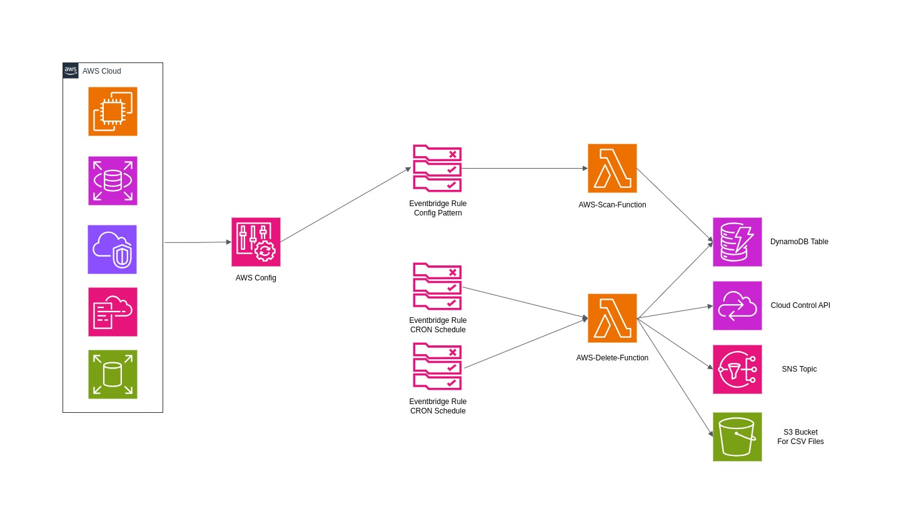
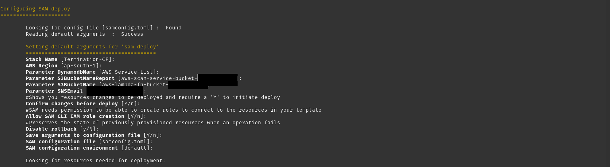
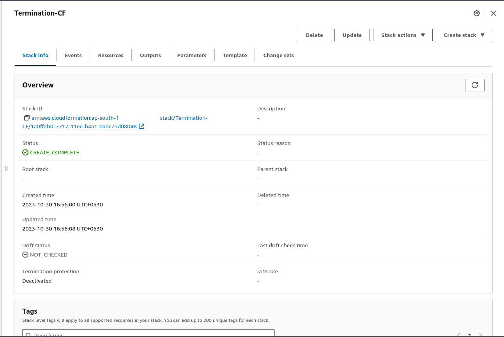

# AWS Spring Cleaning

#### Description:
------------------------------
AWS Spring clean is an automated way to clean your environment on daily basis to avoid unwanted spending. It uses multiple aws services to achive the same. CRUD operations performed on resources within your account and region are monitored through AWS Config, these events are captured and processed before sending relavent data to DynamoDB for persistent storage. Services would be checked for key-value pair **Retain:True**, if not present will be marked for termination. At 18:00 IST the Function is invoked to perform the scan of items present in the Table and send out the report to S3 bucket, with a notification to relavent stakehoder. Finally at 00:00 IST the Function is invoked to perform the delete operation on marked resources for termination. Save the report for the same in the S3 Bucket with notification to the respective stakeholder.


## Steps:

#### Prerequisite:
Ensure that AWS Account/Region you want to monitor has AWS Config enabled. Deploy the stack in the respective region you want to perform spring clean on.

#### Step 1:
configure aws cli with right credentials to launch the mentioned resources:
- Lambda functions and Layer
- DynamoDB Tables
- Eventbridge Rules and Schedule
- IAM Roles
- S3 Bucket
- SNS Topic

Follow the link below:
- https://docs.aws.amazon.com/cli/latest/userguide/cli-chap-configure.html

#### Architecture:


Install aws sam cli, Follow the below link for the same:
- *https://docs.aws.amazon.com/serverless-application-model/latest/developerguide/install-sam-cli.html*

##### Note:
> Make required changes to the Function code and Layer to stay upto date with relavent changes

#### Step 2:
Once completed Please run the below mentioned commands:
```
git clone https://github.com/vn2699/aws-spring-clean.git
cd aws-spring-clean
sam deploy --guided --template template-v2.yaml
```

#### Step 3:
Follow through the mentioned steps and fill out appropriate Parameters:




**Enjoy!!!**
